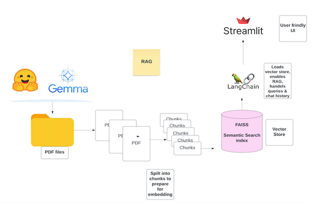

# Influencer Assistant

Influencer Assistant is an advanced tool designed to enhance social media engagement for influencers across various niches like fitness, technology, travel, skincare, and parenting. By leveraging machine learning models, this application processes influencer-specific data to provide tailored advice and actionable recommendations.

## Features

- **Dynamic Content Analysis**: Leverages natural language processing to analyze and offer suggestions based on influencer activity and audience interactions.
- **Engagement Optimization**: Provides strategies for maximizing audience engagement through customized content recommendations.
- **Multi-Niche Support**: Supports a wide range of influencer domains, each with tailored advice based on industry-specific trends and data.
- **Interactive UI**: Built with Streamlit, offering a user-friendly and interactive chat interface for influencers to query and receive advice in real-time.
- **Document Processing**: Integrates PDF document analysis to extract and utilize content relevant to the influencer's niche for deeper insights.

## Technology Stack

- **Streamlit**: For building and hosting the interactive web application.
- **LangChain and OpenAI**: For embedding and retrieval mechanisms, enabling conversational capabilities.
- **Hugging Face**: Utilizes state-of-the-art language models for text generation and natural language understanding.
- **FAISS**: For efficient similarity search in high-dimensional spaces, crucial for matching queries with the most relevant data points.

## Technology Stack

- **Streamlit**: For building and hosting the interactive web application.
- **LangChain and OpenAI**: For embedding and retrieval mechanisms, enabling conversational capabilities.
- **Hugging Face**: Utilizes state-of-the-art language models for text generation and natural language understanding.
- **FAISS**: For efficient similarity search in high-dimensional spaces, crucial for matching queries with the most relevant data points.



## Getting Started

### Prerequisites

Before you begin, ensure you have the following installed:
- Python 3.8 or higher
- pip
- virtualenv (optional, but recommended)

### Installation

1. Clone the repository:
   ```bash
   git clone https://github.com/yourusername/CogniFusion-Influencer-Assistant.git
   cd CogniFusion-Influencer-Assistant


#### Structure of Files:
Data Folder

Directory: /data

Contents:
This directory contains five PDF files with fictional social influencer discovery interviews. Each file provides an in-depth profile of a different social influencer across various niches.

    Milly Adams (@adams_fitness_fanatic) - Focuses on fitness routines and wellness tips.
    Milly Adams (@adams_tech_talk) - Covers the latest technology and gadget reviews.
    Ayesha Patel (@mommybitesandmore) - Offers family-friendly recipes and parenting advice.
    Marco Reyes (@wanderlustwarrior) - Shares travel adventures and destination reviews.
    Naomi Wang (@glowbynaomi) - Provides skincare product reviews and dermatological insights.

These profiles are used within the application to generate tailored advice and insights based on the influencer's focus area.
clean_data.py

Location: /clean_data.py

Functionality:
This Python script is responsible for cleaning and preparing the data from the PDF files for processing. It includes functions to extract text from the PDFs, remove any unwanted characters or formatting, and prepare the data for further analysis or input into the LangChain model.
app.py

Location: /app.py

Functionality:
This is the main Python script that runs the Streamlit application. It integrates the LangChain AI to provide dynamic, conversational AI responses based on the processed influencer profiles. The script includes:

    Setup and initialization of the Streamlit interface.
    Loading and processing of influencer profile data using clean_data.py.
    Implementation of the LangChain conversational model to generate responses.
    Handling user interactions and displaying results in a user-friendly format.

Instructions to Run:
To run the application, navigate to the project's root directory in the terminal and execute the following command:

bash

python3 -m streamlit run app.py

This command launches the Streamlit web server and serves the influencer assistant application, which can be accessed via a web browser at http://localhost:8501.
